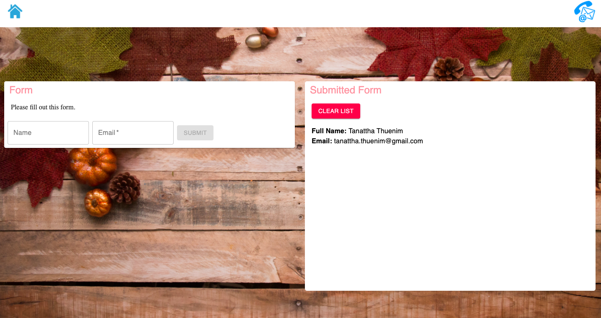

# react-redux-simple-form

This app was built with React and Redux. Display with HTML, CSS and Material UI. This's a sample form app that allows you to submit name and email to the list.

## Live App

[CLICK HERE](https://react-redux-example-form.herokuapp.com/)

## Installation

Fork and clone repos

    $ git clone https://github.com/Tanattha/react-redux-simple-form.git

Using two terminals, switch to each respective directory

    $ cd react-redux-simple-form

Install the packages

    $ npm install

Startup the server for frontend

    $ npm start

## License

The gem is available as open source under the terms of the [MIT License](https://opensource.org/licenses/MIT).

## Special Thanks

https://www.pexels.com/ 
[Font: Sriracha](https://fonts.google.com/specimen/Sriracha)

and everything else from google!
